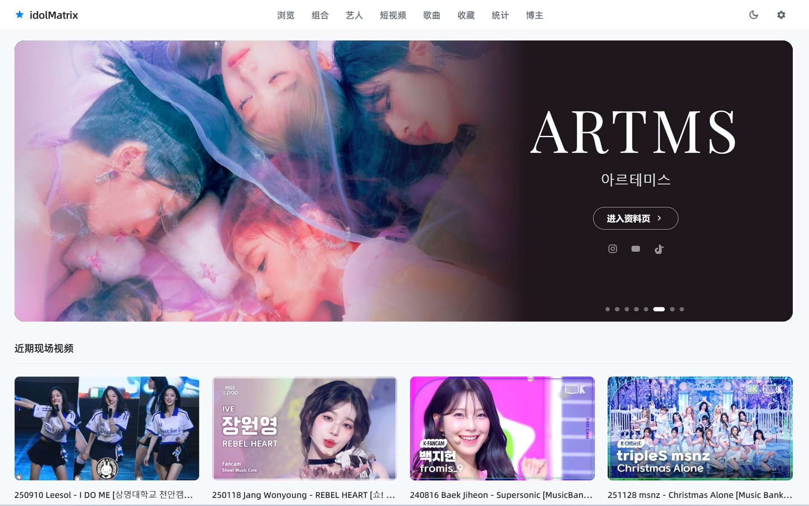
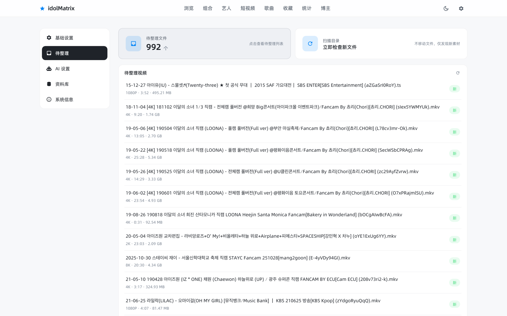
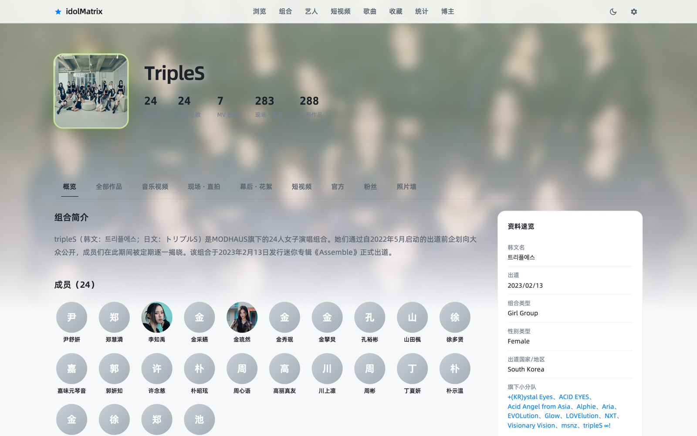

# idolMatrix · K-pop 影像资料库

> 自建的 K-pop 舞台 / 直拍 / 短视频本地媒体库：素材丢进目录 → AI 辅助识别 → 人工确认 → 结构化归档 → 浏览器直接播。
> 单容器跑在 NAS 上，手机和电脑都能用。



---

## 一、开发目的

**起点是一个很具体的麻烦**：我的 K-pop 视频越攒越多（舞台、直拍、MV、综艺、短视频、混剪…），散在硬盘里。
文件名是平台下载后的原始自由文本，夹着画质标签、日期、缩写和韩文，既搜不到也看不清，
想找「某组合某首歌的某场舞台」只能靠记忆翻目录。

**通用媒体服务器（Jellyfin / Emby / Plex）解决不了这个问题**，因为它们的模型是「电影 / 剧集」：

- 一个视频 = 一部电影或一集剧，元数据从 TMDB / TVDB 这类站点刮削；
- 而 K-pop 影像的核心维度是**人**——哪个组合、哪几个成员、哪首歌、哪场活动、什么类型。
  这些字段在影视模型里根本没有位置。

所以这个项目的目标定得很明确：

| # | 目标 | 具体做法 |
|---|---|---|
| 1 | **以「组合 / 艺人 / 歌曲 / 活动」为第一维度**组织视频，而不是「电影 / 剧集」 | 自建实体模型：组合、艺人、成员关系、专辑、歌曲、影像，多态发行主体 |
| 2 | **入库半自动化**：AI 读文件名 + 封面 + 描述给候选，人点确认 | 入库向导 + 本地关系优先的匹配级联，一次入库永久沉淀 |
| 3 | **一个入口看完**：浏览、筛选、搜索、直接在浏览器里播 | 按类型/分辨率/主体多维浏览，不可直放时自动转码 |
| 4 | 顺带长成**一份可查阅的偶像资料库** | 组合/艺人工作台、关联视图、专辑曲目、照片墙、年度统计、数据体检 |

**两个额外的现实约束也影响了设计：**

- **手机是主要观看场景**（竖屏直拍几乎只在手机上看），所以全站从第一天就做移动端适配，而不是事后补；
- **部署必须简单**：低功耗 NAS、单容器、单端口，媒体文件放在 NAS 自己的目录里，
  不能要求用户去折腾数据库和反代。

---

## 二、主要功能

### 2.1 影像入库：AI 识别 + 人工确认

待整理页列出 `incoming/` 里所有待处理的素材（实测这台机器上 992 个），
每一行都带探测到的分辨率与文件大小，右侧「AI 填写」一键让模型读文件名 + 封面 + 描述，吐出结构化元数据：

- 主体（组合 / 艺人）、活动名、日期、曲目、专辑、视频类型、来源；
- **匹配级联**：库内已有关系优先 → 全站模糊匹配 → 都不中才采用 AI 建议，
  并明确标注「这是 AI 编的新实体，入库时才建」；
- 识别结果全部可在入库前手改（曲目多选、专辑增删、主体换人）；
- 中文简介按固定句式生成，也可手改，提示词在设置页可自定义。



### 2.2 浏览与筛选

- 视频类型维度：官方 MV / 官方舞台 / 粉丝直拍 / 特别舞台 / 合作舞台 / 翻唱 / MIX 混剪 / 预告 /
  非表演视频 / 短视频 / 其他，一个下拉即筛（下图＝官方舞台，289 条）；
- 分辨率按**短边**分 9 档（360p ~ 8K），不与转码档位混淆；
- 组合 / 艺人 / 歌曲 / 上传人 四条独立浏览线，均支持搜索、排序、分页跳页；
- 网格密度三档（紧凑 / 标准 / 宽松），移动端显式列数控制（2 / 2 / 1），桌面端自适应填充。


### 2.3 短视频

竖屏短视频单独一页：9:16 卡片网格 + 时长角标 + 排序（最近上传 / 表演日期 / 上传日期），
点开即进沉浸式播放。

### 2.4 播放与转码

- 网页播放器 + HLS 分片播放，**原文件**与**转码版**双源；
- 浏览器能直放的格式直接播原画；不能直放的按档位转码（H.264 + AAC），
  **NAS 核显硬件加速（VAAPI / QSV）**，硬件不可用时自动回退软件编码；
- 转码进行中的分片返回 `503 + Retry-After`，播放器自动续播，不会因为缺一片就报错退出；
- 竖屏直拍有独立沉浸式播放页（移动端全屏）。

### 2.5 资料库：组合 / 艺人 / 专辑 / 歌曲关系网

- **组合页**：成员头像墙（含加入 / 退出日期）、小分队、所属公司、作品计数、组合简介、
  右侧资料速览（韩文名 / 出道日期 / 组合类型 / 国家地区 / 旗下小分队）；
- **艺人页**：所属组合、参与歌曲、作品数、直拍对象；
- **工作台**：媒体图（横幅 1.82:1 / 头像 1:1，可上传或从历史版本切换）、成员轨迹、专辑曲目、资料来源；
- **关联视图**：一张图看清「组合 ↔ 成员 ↔ 小分队 ↔ 公司 ↔ 专辑」的全部关联与数据缺口，附成员 / 公司变迁时间轴。



### 2.6 统计与年度报告

按年份生成「影像年报」：总量 / 总时长 / 磁盘占用、按主体的榜单、类型与分辨率构成、
时间段分布、影像日历热力图、封面九宫格。
（实测这台机器：1082 条影像 / 63 小时 / 557.48 GB。）

### 2.7 移动端

全站移动端适配：底部导航、卡片式详情页、移动端专用的类型 / 分辨率抽屉与筛选条、
竖屏播放页满屏播放。艺人页大字取艺名，小字给本名 / 作品数 / 所属组合。


### 2.8 数据体检 / 照片墙 / 收藏 / 账号与设置

- **数据体检**：数十项规则扫全库——成员日期矛盾、小分队与成员归属冲突、专辑无曲目、
  影像无主体、重复实体、孤立记录…… 按严重度分三级（阻断 / 影响正确性 / 建议），一键跳转去修；
- **照片墙**：按帖子组织图片（可对接外部相册目录或本地上传），帖子大卡片 + 灯箱，大图取磁盘原文件原始字节，零重编码；
- **收藏夹**：视频收藏夹与图片收藏夹；**回收站**：删除的实体与影像可恢复；
- **账号**：单用户登录（argon2 密码哈希），也可配置为免鉴权部署；
- **设置**：AI 服务商 / 模型 / 密钥、外观（主题 / 强调色 / 刊头优先图，跨端同步）、
  存储目录与扫描、系统信息与硬件加速自检。

### 2.9 技术栈与部署

| 层 | 选型 |
|---|---|
| 后端 | FastAPI + SQLAlchemy 2.0 + Pydantic v2 + SQLite（WAL），Alembic 迁移 |
| 前端 | Vue 3 + Vite + Naive UI + Pinia + TypeScript |
| 播放 | xgplayer + HLS 分片 |
| 媒体处理 | 一律 `subprocess` 调用 FFmpeg / ffprobe（参数、日志、退出码完全可控）；封面人脸居中裁切用 OpenCV 本地推理 |
| AI | 外部大模型 API（可配服务商 / 模型 / 提示词），只做候选、不做写入 |
| 部署 | 单容器：后端直接伺服前端构建产物 + `/api`，一个端口；NAS 侧媒体目录全部卷挂载 |

---

## 三、现实痛点：为什么这类库的自动化程度远低于影视类

### 3.1 根因：这个领域**没有可用的元数据站点**

影视类工具的自动化能力，本质是**买来的**：

- 电影 / 剧集：TMDB / TVDB / 豆瓣，丢进文件 → 匹配 → 海报、简介、演员、评分全自动；
- 音乐专辑：MusicBrainz / Discogs / TheAudioDB，也有结构化 API 和统一 ID 体系。

但**「某组合在某场音乐节目某天的舞台直拍」这一类影像，没有任何站点提供结构化数据与 API**。
粉丝社群、Wiki、百科上是有内容的，但那是**人写的文章**，没有可查询的字段——
你没法用 API 问「这首歌 2024 年 3 月的舞台有哪些、分别是谁的直拍」。

**结论很直接：这个项目里「刮削」这一层根本不存在，必须自己把信息从文件名、封面帧、简介文本里读出来。**

### 3.2 文件名是自由文本，不是结构化数据

平台下载下来的名字长这样：

```
[4K] 240301 GroupName Song Title @ Music Bank - Fancam.mp4
```

- 同一首歌有**罗马音 / 英文 / 韩文 / 中文 / 别名 / 缩写**至少五到八种写法；
- 同一场活动有三四种命名习惯，日期格式更是千奇百怪；
- 画质标签、频道名、`[]` `()` 里的杂物混在里面。

所以匹配逻辑不能是字符串精确比对，只能是**本地关系优先 + 模糊匹配级联**：
库里已有的组合 / 歌曲 / 活动先在本地命中，命中不了才让 AI 建议新实体，并显式标注「AI 新建」。

### 3.3 因此流程只能是「AI 给候选 + 人工核对」

在这种数据上做全自动入库**必然出错**，而且错得很隐蔽：

- 把合唱里的另一位成员认成主唱；
- 把音乐节目名当成活动名、把专辑名当成歌名；
- 把旧标题里的画质标签当成作品名的一部分。

一次错误会被写进数据库、写进文件路径，事后清理的成本比手动输一遍还高。
现阶段的取舍是：**AI 只做候选，入库动作由人点确认**。
好处是每次核对的结果都沉淀进本地库，下一次同类视频的候选就更准——**用数据自我进化来弥补外部数据源的缺失**。

同一逻辑也体现在提示词上：中文简介**只允许写来源里明确提到的事实**，不许补画质、不许加主观评价、
没写就不许编——因为这段文字最终是要和人核对的内容，宁缺毋滥。

### 3.4 附带的三个成本

- **多语言实体消歧**：韩文 / 英文 / 中文 / 罗马音并存，重名、改名、小分队让「谁是谁」必须人工判；
- **数据会自相矛盾**：库涨到几千条之后，成员日期、归属关系开始互相打脸 → 才需要专门做一个「数据体检」；
- **只有转码和播放这一层是"通用"的**：FFmpeg 是标准件，反而是整条链路里最省心的部分。

### 3.5 一句话总结

> 影视类工具买的是「元数据 + 自动化」；这个项目买不到元数据，
> 只能用 AI 猜测 + 人工核对硬做出来，**所以它的自动化上限天然比影视类低一个层级**。
> 项目里所有的设计取舍——AI 只给候选、本地关系优先、数据体检、只管沉淀——都是围绕这个约束展开的。

---

## 附：当前状态

- 版本 `3.6.5`，已在自建 NAS（Docker 单容器）上日常使用，库内 1000+ 影像 + 完整组合 / 艺人 / 专辑 / 歌曲关系；
- 本文所有截图均为该实例实拍（浅色主题 · 1440 px 桌面 / 390 px 移动端），未做任何修图；
- 尚未完成：多用户与权限、公开元数据源接入（没有可用源，见第三节）、原生移动端 App。
